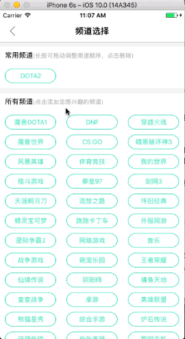
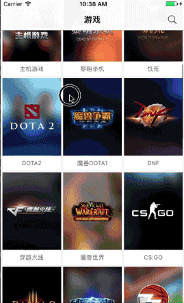
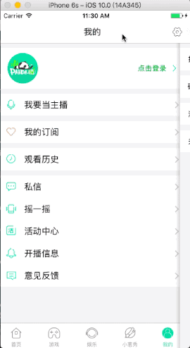

# PandaTV
**Swift3.0 + MVVM 之熊猫TV**
> **导读:** 现在直播比较热门，市面上有很多直播APP，比如熊猫TV、斗鱼、映客、喵播、战旗等等。本人屌丝一枚，平时也玩玩LOL，我不会告诉你我是青铜5的渣渣😂😂😂。 工作了没电脑玩，就看看直播，所以就有了这个仿写的项目。
****
>**声明:** 1.这个项目中的接口都是用青花瓷[下载地址](https://pan.baidu.com/s/1pL6ClBX)抓取的，只用作学习。关于如何用青花瓷抓取数据, [请点击这里](http://www.cnblogs.com/dsxniubility/p/4621314.html)
> 2.项目中的素材都是从熊猫TV.ipa中提取出来的，这里提供一个工具 [iOS Image Extractor](https://github.com/devcxm/iOS-Images-Extractor) 关于这个工具如何使用，请看[这篇文章](http://blog.csdn.net/github_33362155/article/details/51206299)
****
> **工程环境:** Xcode8.0 + swift3.0
> **使用框架:** **Alamofire**请求数据，**Kingfisher**加载图片。 两个框架的用法github官方有，网上也有，项目中也有。

#####项目介绍
一开始是想把直播做好的，应为这才是精髓，**奈何青花瓷抓取不到直播地址**，弄了很久，也抓取不到。只能说尽力了。如果有大神有获取直播间播放地址的方法，请告知

**真是抓取不到直播间地址，不是我不做视频功能，大家可以自己试试**

**真是抓取不到直播间地址，不是我不做视频功能，大家可以自己试试**

**真是抓取不到直播间地址，不是我不做视频功能，大家可以自己试试**

重要的事情说三遍

整个项目分为5大模块：首页、游戏、娱乐、小葱秀、我的。下面用5张图片简单介绍各个界面构成

- 首页：
	- 点击rightBarButtonItem跳转搜索控制器，可以搜索你感兴趣的内容
	- 菜单视图切换控制器，可以左右滑动，点击 ➕ 跳转频道选择页面，可以添加自己喜欢的频道
	- 广告滚动栏，collectionView + pageControl
	- 各种分类，collectionView分组实现

- 频道选择控制器：
	- 1. 初始状态，常用频道没有内容。用户点击所有频道列表，点击的频道会从所有频道移除，添加到常用频道
	- 2. 常用频道有内容时，当用户点击常用频道，所点击的频道会从常用频道移除，自动添加到所有频道中最后一个
	- 3. 当常用频道有内容时， 用户长按某一个频道，能在常用频道中随意拖动更换位置
	- 4. 当用户点击左上角返回按钮时，常用频道会同步更新到菜单选择器中。

 

- 游戏
	- collectionView实现，没什么好说的。点击每个item跳转不同游戏分类视频列表，也是collectionView实现

- 娱乐
	- pageTitleView，切换频道，可左右滑动
	- 下面是collectionView，没什么好说的 

- 小葱秀
	- 使用UIWebwView加载网页
	

- 我的
	- tableview静态cell分组 

本项目是用swift + MVVM 写的。 本人也是才接触swift不久，对swift3.0的了解也不是很透彻，所有项目中存在很多问题或者垃圾代码。**如果你有什么好的建议或者意见可以issu我，或者可以私信[我的简书](http://www.jianshu.com/u/66a861134217)，或者给我[发邮件](yang121yang@yeah.net)**

**你觉得对你有所帮助的话，请献上宝贵的Star！！！ 不胜感激！！！**
